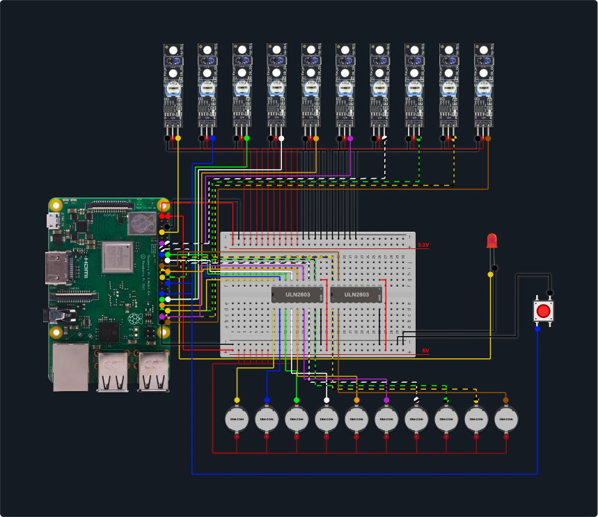

<div align="center">
 
</div>

# Proyecto Dome: Instalación Interactiva

Este proyecto controla una instalación interactiva con 10 sensores de proximidad (KY-033), 10 motores de vibración (ERM) y un sistema de audio sincronizado, todo gestionado por una Raspberry Pi.

## Requisitos de Hardware

- Raspberry Pi 3 o superior.
- 10x Sensores de seguimiento de línea KY-033.
- 1x Botón pulsador (para Inicio/Reinicio).
- 10x Motores de vibración tipo moneda (ERM).
- 2x Driver de motor ULN2803A.
- Fuente de alimentación de 5V para los motores (Opcional).
- Altavoces o auriculares conectados a la Raspberry Pi.

### Notas de Conexión



- **Modo de pines**: BCM.
- **Sensores**: Conectar las salidas digitales a los pines GPIO de entrada definidos en `app/config.py`.
- **Botón de Inicio**: Conecta una pata al GPIO 7 y la otra a Tierra (GND). El sistema usa una resistencia pull-up interna.
- **Motores**: Conecta el GND de los motores a las salidas del ULN2803A. Las entradas del ULN2803A se conectan a los pines GPIO de salida de la Raspberry Pi. Sigue los pines definidos en `app/config.py`.
- **Alimentación**: El pin `COM` del ULN2803A debe conectarse a la fuente de +5V que alimenta los motores. Asegúrate de que haya una tierra común (GND) entre la Raspberry Pi y la fuente de alimentación de los motores.

## Instalación de Software

1.  **Clonar el repositorio (si aplica) o transferir los archivos** a tu Raspberry Pi, por ejemplo, en `~/projects/dome`.

2.  **Crear un entorno virtual (recomendado)**:
    ```bash
    python3 -m venv .venv
    source .venv/bin/activate
    ```

3.  **Instalar las dependencias**:
    ```bash
    pip install -r requirements.txt
    ```

## Configuración

1.  **Colocar los archivos de audio**:
    Añade tus archivos de audio en formato MP3 a la carpeta `audios/`. 
    -   **Sonidos Principales**: Uno para cada constelación. Deben nombrarse `audio1.mp3`, `audio2.mp3`, ..., `audio10.mp3` para que se mapeen automáticamente al sensor y motor correspondiente.
    -   **Sonido de Introducción**: Nombra un archivo `intro.mp3`. Este sonará cuando se presione el botón de inicio.

    Si falta un archivo (por ejemplo, `audio5.mp3`), el sensor 5 y el motor 5 quedarán deshabilitados.

2.  **Ajustar la configuración (opcional)**:
    Puedes modificar los pines, tiempos y otros parámetros en el archivo `app/config.py`.

## Sincronización Automática con Google Drive (Opcional)

El proyecto incluye un script para descargar y sincronizar automáticamente los archivos de audio desde una carpeta de Google Drive. Esto es útil para actualizar los sonidos de forma remota.

### 1. Requisitos Previos

- Una cuenta de servicio de Google Cloud con la API de Google Drive habilitada.
- Las credenciales de la cuenta de servicio en un archivo `credentials.json`.
- Las librerías de Python necesarias: `pip install google-api-python-client google-auth-httplib2 google-auth-oauthlib`

### 2. Configuración del Script

1.  **Coloca tus credenciales**: Guarda tu archivo `credentials.json` en una ubicación segura fuera de este proyecto, por ejemplo, en `/home/admin/Arathe/credentials.json`.

2.  **Edita el script `sync_drive_audios.py`**:
    -   Asegúrate de que `SERVICE_ACCOUNT_FILE` apunte a la ruta correcta de tu `credentials.json`.
    -   Actualiza `FOLDER_ID` con el ID de la carpeta de Google Drive que contiene tus archivos de audio.

### 3. Ejecución Manual y Depuración

Para probar el script manually y ver si hay errores (por ejemplo, de credenciales o de red), puedes ejecutarlo directamente desde tu entorno virtual:

```bash
source .venv/bin/activate
python sync_drive_audios.py
```

### 4. Ejecución Automática con systemd

Para que el script se ejecute automáticamente cada vez que la Raspberry Pi se enciende, crearemos un servicio de `systemd`.

1.  **Crea el archivo de servicio**:
    ```bash
    sudo nano /etc/systemd/system/sync_dome_audios.service
    ```

2.  **Pega el siguiente contenido** en el archivo. Asegúrate de que la ruta al `python` de tu entorno virtual (si usas uno) y al script sean correctas.

    ```ini
    [Unit]
    Description=Sincronizar audios del proyecto Dome desde Google Drive
    After=network.target

    [Service]
    User=admin
    WorkingDirectory=/home/admin/projects/dome
        # ¡IMPORTANTE! Usa la ruta al Python de tu entorno virtual.
    ExecStart=/home/admin/projects/dome/.venv/bin/python /home/admin/projects/dome/sync_drive_audios.py
    Restart=on-failure

    [Install]
    WantedBy=multi-user.target
    ```

3.  **Habilita e inicia el servicio**:
    ```bash
    sudo systemctl daemon-reload
    sudo systemctl enable sync_dome_audios.service
    sudo systemctl start sync_dome_audios.service
    ```

4.  **Verifica el estado** del servicio para asegurarte de que todo funciona correctamente:
    ```bash
    sudo systemctl status sync_dome_audios.service
    ```

---

## Feedback del LED (GPIO 11)

El sistema utiliza un LED para proporcionar feedback visual sobre su estado actual:

-   **Parpadeo rápido durante el inicio**: El script `sync_drive_audios.py` se está ejecutando, descargando o verificando los archivos de audio desde Google Drive.
-   **Pulso lento (efecto "respiración")**: Modo de espera. El sistema está esperando el botón de inicio (estado inicial) o que un usuario se acerque a un sensor.
-   **LED encendido fijo**: Modo activo. El audio se está reproduciendo (ya sea la introducción o un sonido de constelación).
-   **Parpadeo rápido (durante la operación)**: Se ha detectado un nuevo sensor. El sistema está esperando la confirmación de 3 segundos para cambiar al nuevo audio.

---

## Ejecución

Para iniciar el servicio principal, ejecuta el siguiente comando desde el directorio raíz del proyecto (`~/projects/dome`):

```bash
python3 -m app.main
```

Para detener el servicio, presiona `Ctrl+C`.

### Interacción del Usuario (Botón)

-   **Iniciar Experiencia**: Pulsación corta cuando el LED está pulsando ("respirando"). Reproduce `intro.mp3`.
-   **Saltar Intro**: Pulsación corta durante la introducción para saltar directamente al modo interactivo.
-   **Reiniciar**: Pulsación larga (3 segundos) en cualquier momento para reiniciar el sistema al estado de espera.

### Comandos Adicionales

Para probar los motores individualmente (cicla a través de todos ellos):

```bash
python3 -m app.main --test-motors
```

Para verificar qué archivos de audio han sido detectados y mapeados correctamente, puedes usar el siguiente comando:

```bash
python3 -m app.main --list-audios
```
