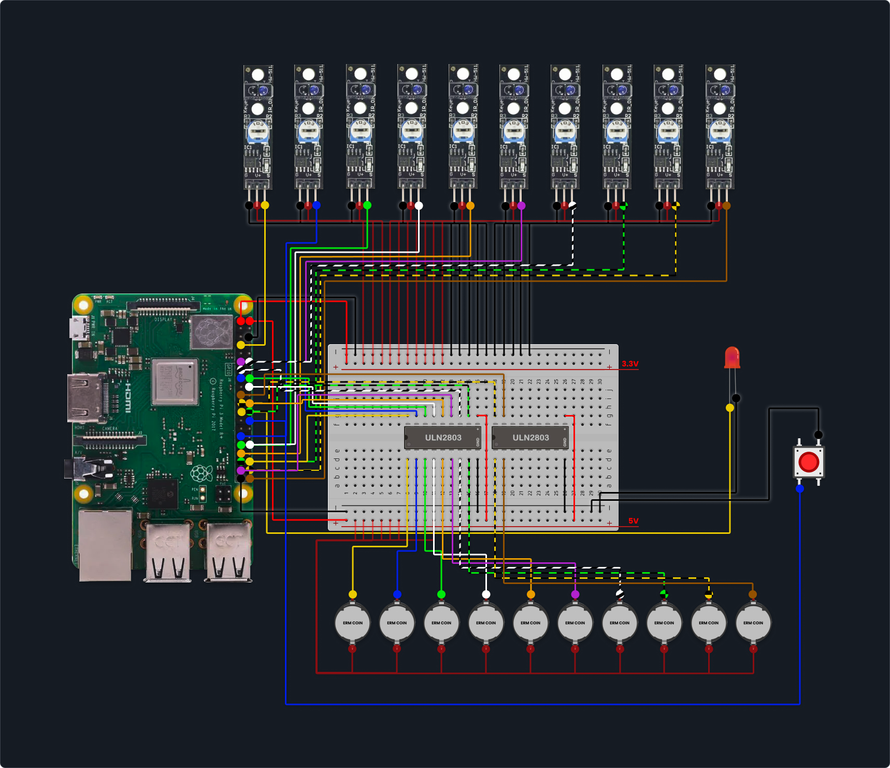

# Dome Project: Interactive Installation

This project controls an interactive installation with 10 proximity sensors (KY-033), 10 vibration motors (ERM), and a synchronized audio system, all managed by a Raspberry Pi.

## Hardware Requirements

- Raspberry Pi 3 or newer.
- 10x KY-033 Line Tracking Sensors.
- 1x Push Button (for Start/Restart).
- 10x Coin-type ERM Vibration Motors.
- 2x ULN2803A Motor Driver.
- Speakers or headphones connected to the Raspberry Pi.
- 5V power supply for the motors (Optional).

### Wiring Notes



- **Pin Mode**: BCM.
- **Sensors**: Connect the digital outputs to the GPIO input pins defined in `app/config.py`.
- **Start Button**: Connect one leg to GPIO 7 and the other to Ground (GND). The system uses an internal pull-up resistor.
- **Motors**: Connect the motors' GND to the ULN2803A outputs. The ULN2803A inputs connect to the Raspberry Pi's GPIO output pins. Follow the pins defined in `app/config.py`.
- **Power**: The `COM` pin of the ULN2803A must be connected to the +5V supply that powers the motors. Ensure there is a common ground (GND) between the Raspberry Pi and the motor power supply.

## Software Installation

1.  **Clone the repository (if applicable) or transfer the files** to your Raspberry Pi, for example, in `~/projects/dome`.

2.  **Create a virtual environment (recommended)**:
    ```bash
    python3 -m venv .venv
    source .venv/bin/activate
    ```

3.  **Install dependencies**:
    ```bash
    pip install -r requirements.txt
    ```

## Configuration

1.  **Place Audio Files**:
    Add your MP3 audio files to the `audios/` folder. 
    -   **Main Sounds**: One for each constellation. Must be named `audio1.mp3`, `audio2.mp3`, ..., `audio10.mp3` to be automatically mapped to the corresponding sensor and motor.
    -   **Intro Sound**: Name a file `intro.mp3`. This will play when the start button is pressed.

    If a file is missing (e.g., `audio5.mp3`), sensor 5 and motor 5 will be disabled.

2.  **Adjust Settings (optional)**:
    You can modify pins, timings, and other parameters in the `app/config.py` file.

## Automatic Sync with Google Drive (Optional)

The project includes a script to automatically download and sync audio files from a Google Drive folder. This is useful for updating sounds remotely.

### 1. Prerequisites

- A Google Cloud service account with the Google Drive API enabled.
- The service account credentials in a `credentials.json` file.
- The required Python libraries: `pip install google-api-python-client google-auth-httplib2 google-auth-oauthlib`

### 2. Script Configuration

1.  **Place your credentials**: Save your `credentials.json` file in a secure location outside this project, for example, in `/home/admin/Arathe/credentials.json`.

2.  **Edit the `sync_drive_audios.py` script**:
    -   Ensure `SERVICE_ACCOUNT_FILE` points to the correct path of your `credentials.json`.
    -   Update `FOLDER_ID` with the ID of the Google Drive folder containing your audio files.

### 3. Manual Execution and Debugging

To test the script manually and check for errors (e.g., credential or network issues), you can run it directly from your virtual environment:

```bash
source .venv/bin/activate
python sync_drive_audios.py
```

### 4. Automatic Execution with systemd

To have the script run automatically every time the Raspberry Pi boots up, we will create a `systemd` service.

1.  **Create the service file**:
    ```bash
    sudo nano /etc/systemd/system/sync_dome_audios.service
    ```

2.  **Paste the following content** into the file. Make sure the path to your virtual environment's `python` executable and the script are correct.

    ```ini
    [Unit]
    Description=Sync Dome project audios from Google Drive
    After=network.target

    [Service]
    User=admin
    WorkingDirectory=/home/admin/projects/dome
    # IMPORTANT! Use the path to your virtual environment's Python.
    ExecStart=/home/admin/projects/dome/.venv/bin/python /home/admin/projects/dome/sync_drive_audios.py
    Restart=on-failure

    [Install]
    WantedBy=multi-user.target
    ```

3.  **Enable and start the service**:
    ```bash
    sudo systemctl daemon-reload
    sudo systemctl enable sync_dome_audios.service
    sudo systemctl start sync_dome_audios.service
    ```

4.  **Check the status** of the service to ensure everything is working correctly:
    ```bash
    sudo systemctl status sync_dome_audios.service
    ```

---

## LED Feedback (GPIO 11)

The system uses an LED to provide visual feedback on its current state:

-   **Fast Blinking on Boot**: The `sync_drive_audios.py` script is running, downloading, or verifying audio files from Google Drive.
-   **Slow Pulse ("Breathing" Effect)**: Standby mode. The system is waiting for the Start Button (initial state) or for a user to approach a sensor.
-   **Solid On**: Active mode. Audio is playing (either the Intro or a Constellation sound).
-   **Fast Blinking (during operation)**: A new sensor has been detected. The system is waiting for the 3-second confirmation to switch to the new audio.

---

## Running the Application

To start the main service, run the following command from the project's root directory (`~/projects/dome`):

```bash
python3 -m app.main
```

To stop the service, press `Ctrl+C`.

### User Interaction (Button)

-   **Start Experience**: Short press when the LED is pulsing ("breathing"). Plays `intro.mp3`.
-   **Skip Intro**: Short press during the intro to skip directly to the interactive mode.
-   **Restart**: Long press (3 seconds) at any time to reset the system to the standby state.

### Additional Commands

To test the motors individually (cycles through all of them):

```bash
python3 -m app.main --test-motors
```

To check which audio files have been detected and mapped correctly, you can use the following command:

```bash
python3 -m app.main --list-audios
```
